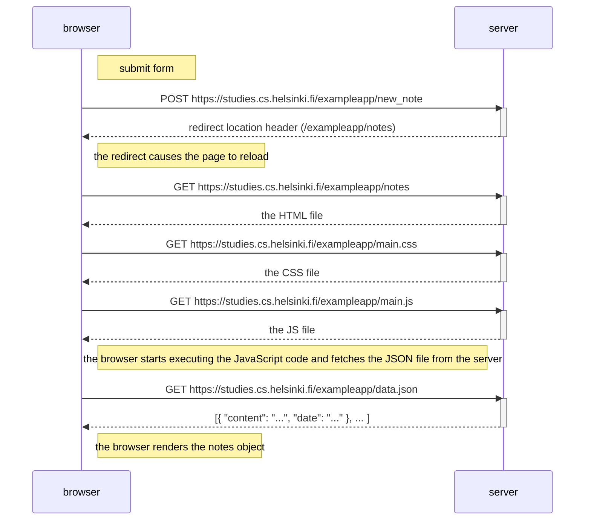

```mermaid
sequenceDiagram
  participant browser
  participant server

  Note right of browser: submit form

  browser->>server: POST https://studies.cs.helsinki.fi/exampleapp/new_note
  activate server
  server-->>browser: redirect location header (/exampleapp/notes)
  deactivate server

  Note right of browser: the redirect causes the page to reload

  browser->>server: GET https://studies.cs.helsinki.fi/exampleapp/notes
  activate server
  server-->>browser: the HTML file
  deactivate server

  browser->>server: GET https://studies.cs.helsinki.fi/exampleapp/main.css
  activate server
  server-->>browser: the CSS file
  deactivate server

  browser->>server: GET https://studies.cs.helsinki.fi/exampleapp/main.js
  activate server
  server-->>browser: the JS file
  deactivate server

  Note right of browser: the browser starts executing the JavaScript code and fetches the JSON file from the server

  browser->>server: GET https://studies.cs.helsinki.fi/exampleapp/data.json
  activate server
  server-->>browser: [{ "content": "...", "date": "..." }, ... ]
  deactivate server

  Note right of browser: the browser renders the notes object
```
